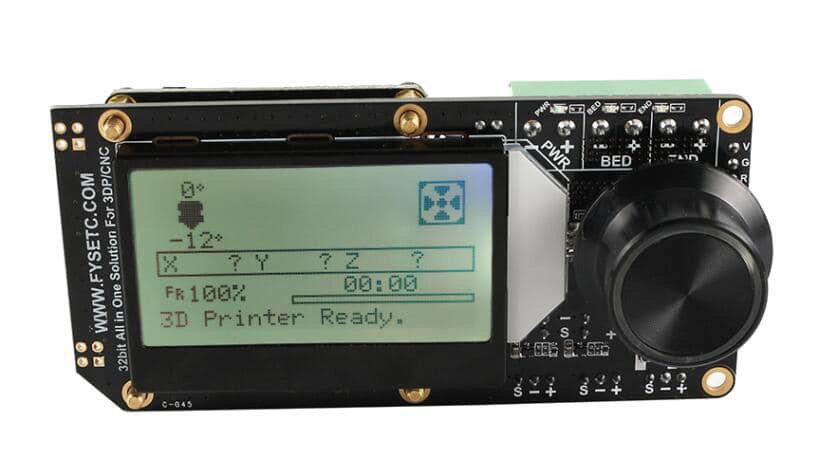

## Product Introduction

This is an All In One (So we call it AIO) solution with 32-bit MCU and 256-microsteps stepper motor drive for  3DP/CNC or similar machine.It has everything you need to assemble a 3DP, including a display and an SD card holder.

## Features

- Compact size: 105mm x 50mm
- fully integrated all in one solution:
  - **STM32F103 MCU (Run Marlin 2.0 )**
  - CH340 for high speed USB serial connection and firmware upload 
  - **4X ST820 stepper drivers, 256 Microsteps**
- UNIVERSAL POWER:
  - can be used with 7V-35V for motors / heated bed
  - integrated high precision power regulators (DC/DC):  5V 1A Max and 3.3V  600mA Max LDO
- **Onboard SD card socket **
- **Onboard RGB mini12864 LCD** 
- Onboard RGB control
- **Support firmware upload via USB or SD**
- PCB：
  - High quality, High temperature FR4-TG130 PCB
  - Gold ENIG finishing
