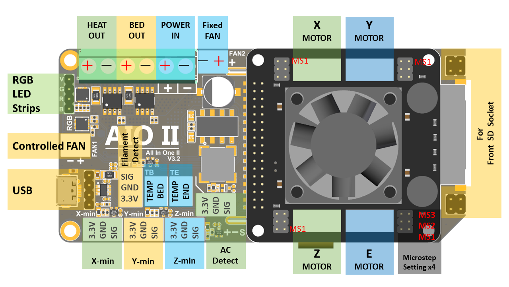
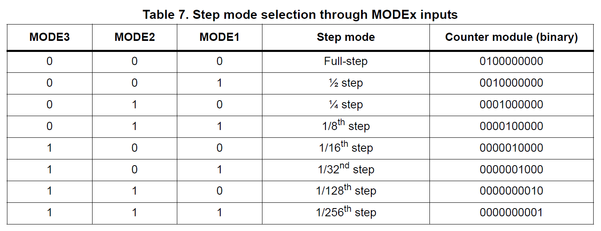

***Sorry, this page is being writed, and there is still some content waiting to be conpleted. Please be patient!*** 

## Product Introduction


This is an All In One (So we call it AIO) solution with 32-bit MCU and 256-microsteps stepper motor drive for  3DP/CNC or similar machine.It has everything you need to assemble a 3DP, including a display and an SD card holder.

## Features
- Compact size: 105mm x 50mm
- fully integrated all in one solution:
  - **STM32F103 MCU (Run Marlin 2.0 )**
  - CH340 for high speed USB serial connection and firmware upload 
  - **4X ST820 stepper drivers, 256 Microsteps**
- UNIVERSAL POWER:
  - can be used with 7V-35V for motors / heated bed
  - integrated high precision power regulators (DC/DC):  5V 1A Max and 3.3V  600mA Max LDO
- **Onboard SD card socket **
- **Onboard RGB mini12864 LCD** 
- Onboard RGB control
- **Support firmware upload via USB or SD**
- PCB：
  - High quality, High temperature FR4-TG130 PCB
  - Gold ENIG finishing

## Application
- 3D printer 
- CNC Machines
- Other similar machines

## Hardware Reasources
| Board Name           | AIO II                                |
| -------------------- | ------------------------------------- |
| License              | GPL V2.0                              |
| Latest Version       | V1.0                                  |
| Extruders            | 1                                     |
| Fixed Fans           | 1 Max                                 |
| Controlled Fans      | 1 Max                                 |
| Heaters              | 2 Max                                 |
| Endstops             | 3 Max, 3Pin XH header                 |
| Temp sens            | 2 Max                                 |
| I2C                  | 1                                     |
| SWD                  | 1                                     |
| Serial port chip     | CH340                                 |
| CPU                  | STM32F103                             |
| CPU Speed ( MHz )    | 72 Mhz                                |
| Stepper driver       | 4X ST820                              |
| Stepper driver  Type | Modular, replaceable.                 |
| Input                | 7-35 V 15A Max；                      |
| Output               | BED OUT：10A Max ；Heater Out：5A Max |

### Pin Definition
#### Connector define :

#### Microsteps setting : 

## Firmware Guide

### Pre-buids

There is ```AIO-TEST-ST820.hex``` pre-build firmware for you to test the board if you can't drive this board with your own firmware.

### Build the firmware

You can follow the following steps to build the firmware your self.

#### Download Vscode + platformio

To compile the firmware , you need to install Visual Studio Code and the platformio pulg-in.

#### Download firmware

If you download already downloaded this repo, the firmware is in the ```firmware``` folder. If not, you can find it [here](https://github.com/FYSETC/FYSETC-AIO_II/tree/master/firmware/Marlin).

#### Configure the firmware

We have three seperated stepper driver module for this AIO_II board, you need to change the config according to different module.

- 4 * ST820

```
#define X_DRIVER_TYPE  A4988
#define Y_DRIVER_TYPE  A4988
#define Z_DRIVER_TYPE  A4988
#define E0_DRIVER_TYPE A4988
```

- 4 * TMC2208

```
#define X_DRIVER_TYPE  TMC2208
#define Y_DRIVER_TYPE  TMC2208
#define Z_DRIVER_TYPE  TMC2208
#define E0_DRIVER_TYPE TMC2208
```

- 4 * TMC2209

```
#define X_DRIVER_TYPE  TMC2209
#define Y_DRIVER_TYPE  TMC2209
#define Z_DRIVER_TYPE  TMC2209
#define E0_DRIVER_TYPE TMC2209
```

*note: The latest configurations are in separate repository [here](https://github.com/MarlinFirmware/Configurations/tree/bugfix-2.0.x), you can download and find the config in config/Fysetc/AIO_II folder.*

#### Compile the firmware

Open Vscode and open platformio main page and click the "Open Project" button , and direct to the folder where you put your firmware.


If everything goes fine , at the bottom you can see several buttons


The check mark is for compiling .

Open platformio.ini file and change the option default_envs as below.

default_envs = fysetc_STM32F1

And then replace the default configuration.h and configuration_adv.h with files locate in FIRMWARE_LOCATE\Marlin\Marlin\config\examples\FYSETC according to your board.

Then click check mark to compile.

If you can't generate the hex file, you may need to open vscode using Administrator Account .

For more detail information，you can refer to http://marlinfw.org/docs/basics/install_platformio.html

#### Upload the firmware(windows,linux,Mac)

We provide several ways to upload the firmware .You can just click the upload button to upload the firmware or refer to the two methods below.

#### Upload the firmware(windows)

After compiling , you should see the firmware file "firmware.hex" in the folder FIRMWARE_LOCATE\Marlin\Marlin\\.pioenvs\fysetc_STM32F1\

Download the flash software in our github https://github.com/FYSETC/STM32Flasher

Connect the board and your pc with USB cable (This step should before you open the software)

Double the click "FlyMcu.exe" software to open it.


1. Select "***Reset@DTR low(<-3v),ISP @RTS High***"
2. Click "Port" to select the port of your USB 
3. Select ***FIRMWARE_LOCATE\Marlin\Marlin\\.pioenvs\fysetc_STM32F1\firmware.hex*** as the screenshot shows.
4. At last ,click the "Start ISP(p)" to upload the firmware.

#### Upload the firmware(linux)

##### Load usb driver

Delete the old version driver /lib/modules/$(uname -r)/kernel/drivers/usb/serial/ch341.ko

```
rm /lib/modules/$(uname -r)/kernel/drivers/usb/serial/ch341.ko
```

Download the CH34x driver(linux version) from our github

https://github.com/FYSETC/CH340-Driver

follow the readme.txt to make and load the driver .

If you want the driver load automatically every time your PC power up. You can copy the ch34x.ko file to 

directory /lib/modules/$(uname -r)/kernel/drivers/usb/serial/ , and do

```
depmod 
```

##### Install stm32flash tool

First get the code

```
git clone https://git.code.sf.net/p/stm32flash/code stm32flash-code
```

Then follow the INSTALL file to install the software

##### Upload the firmware

Connect the motherboard with USB cable and your PC. And do

```
dmesg
```

And you will get message like 


the ttyUSB0 is the port to communicate with the motherboard.

And then go the the firmware.hex file location directory and do the follow command to upload the firmware

```
 stm32flash -w firmware.hex -v -i rts,-dtr /dev/ttyUSB0
```

## Bootloader

If you want to update the firmware from sdcard, you can try this [bootloader.](https://github.com/FYSETC/Bootloader-STM32F103) Follow the README there.

## Attachments

------
- [Schematic files](https://github.com/FYSETC-AIO_II/)
- [PCB files](https://github.com/FYSETC/FYSETC-AIO_II/)
- [2D and 3D drawings](https://github.com/FYSETC/FYSETC-AIO_II/)

## Where to Buy
------
- [FYSETC AIO II V3.1](https://www.aliexpress.com/item/32888370577.html)

## Tech Support
-------
For some reason,, we have to access Facebook via VPN...so our engineers can't reply to your question on Facebook in time, if possible, please ask questions in the forum.
**Please submit any technical issue into our [forum](http://forum.fysetc.com/)** .

